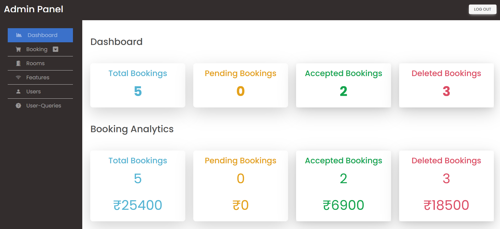

# 🏨 Hotel Booking Website

A frontend hotel booking website built using HTML, CSS, and basic JavaScript as part of my early web development learning phase.  
This project focuses on website structure, layout design, and simple interactivity.

---

## 📸 Screenshots

### Homepage

### Admin Page

---

## 📌 Features
- Homepage with hotel overview  
- Rooms listing section  
- Basic booking / contact form  
- Simple navigation menu  
- Static content layout  

---

## 🛠️ Tech Stack
- HTML – Page structure  
- CSS – Styling and layout  
- JavaScript (basic) – Simple interactivity  

---

## 🎯 Purpose of This Project
This project was created to:
- Practice building multi-page websites  
- Strengthen HTML and CSS fundamentals  
- Learn basic JavaScript usage  
- Understand static website hosting  

---

## 🚧 Limitations
- No real booking or payment functionality  
- Static content only  

---

## 🔮 Possible Improvements
- Make the website fully responsive  
- Improve UI/UX design  
- Add backend booking functionality  
- Upgrade to a modern frontend framework  

---

## 📈 Learning Outcome
This project represents my foundation in frontend development and reflects my growth before moving on to more advanced AI and backend-focused projects.

---

⭐ This repository showcases my learning journey and early hands-on experience in web development.

